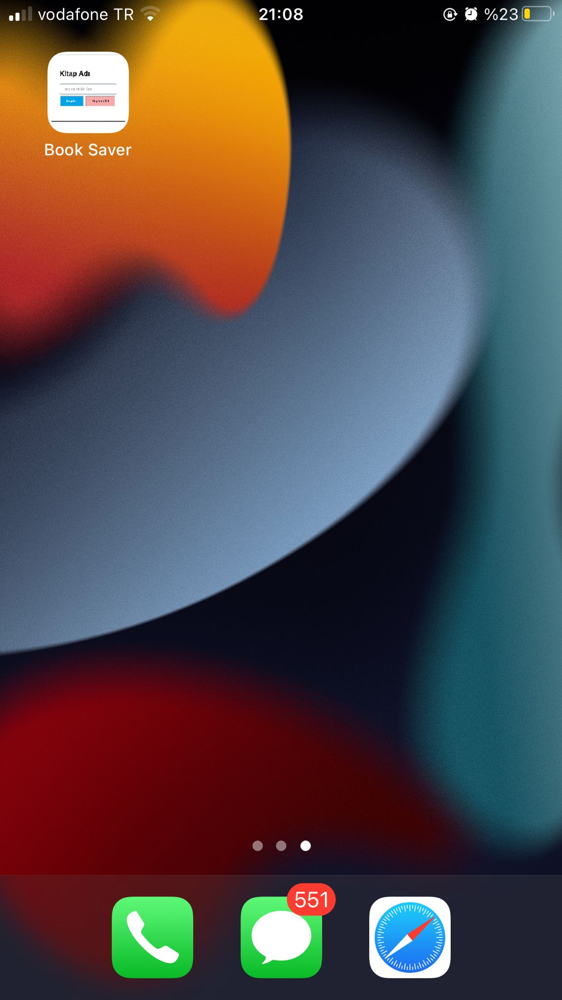

# Kitaplar-m

Bu repo, okuduğunuz kitapları dijital ortamda kayıt altına alabileceğiniz bir **Real Time Database** projesini içermektedir.

# Pipeline


## Kurulum

1. **Repoyu indirin:**

    ```bash
    git clone https://github.com/Umit-Yilmaz/Kitaplar-m.git
    cd kitaplar-m
    ```

2. **index.js içerisine Firebase konfigrasyon niteliklerini girin.**

    Firebase hesabı açın, yeni proje oluşturun ve aşağıdaki adımları takip edin.
   
   
   

4. **index.html dosyasını çalıştırın.**


## Kullanım

Proje çalıştırıldığında, okuduğunuz kolayca kitapları ekleyebilirsiniz.


# Netlify Deploy

URL: https://harmonious-sundae-689f90.netlify.app/

# Mobil Uyumlu


 


## Lisans

Bu proje [MIT Lisansı](LICENSE) altında lisanslanmıştır.

